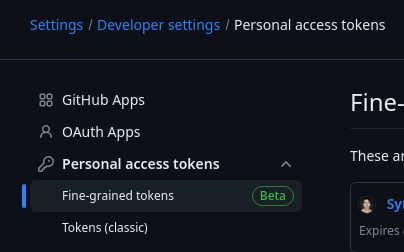
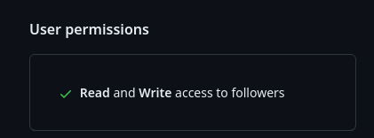
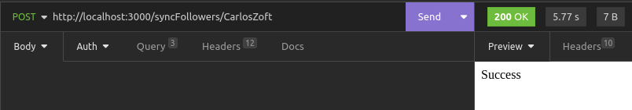

# Sync Github Followers


For running the app and sync your followers / following

#### Before All :
**Enviroment - Node >= v18**

1 - Create a personal access token :




2 - Now add the permission - **Read and Write access to followers**



3 - Create a file called .env and add the variable - **AUTH_GITHUB**

```AUTH_GITHUB=generated_token_step_1```

#### Locally :

- **yarn install** or **npm install** (to install dependencies)
- **yarn dev** or **npm run dev** (to setup server)
- Make a POST request to http://localhost:3000/syncFollowers/:username
Ex:
 

#### Extras :

Personally, i prefer that run automatically. If you prefer that too, you can add the code on a chrono job platform as [pipedream](https://pipedream.com/) or [googlescripts](https://script.google.com/) :) 
